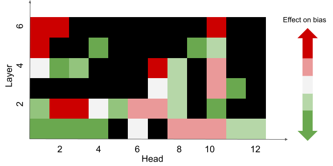

# Fairness-Aware Structured Pruning in Transformers (AAAI 2024)
Welcome to the official repository for the AAAI [paper](https://arxiv.org/pdf/2312.15398.pdf) “Fairness-Aware Structured Pruning in Transformers”. We present a novel method to prune the attention heads that negatively impact fairness in transformer-based models while retaining most of the language modeling ability.

## How it works
The figure below is an illustration of applying FASP to a model with $6$ layers and $12$ heads per layer, e.g. DistilGPT-2. We identify and exclude the heads that significantly impact performance from the pruning process (black squares). Subsequently, the remaining heads are prioritized for removal
based on their contribution to bias, ensuring that the heads
contributing the most to bias are pruned first (red squares).
<div style="text-align: center">

<p style="text-align: center;">  </p>
</div>

## Running the experiments
Get started with the Colab tutorial, `FASP_AAAI24_reproducibility.ipynb`, which guides you through the process of downloading the models, understanding the preprocessing steps, and creating the scripts required to run the experiments. 

## Citation
```
@article{zayed2023fairness,
  title={Fairness-Aware Structured Pruning in Transformers},
  author={Zayed, Abdelrahman and Mordido, Goncalo and Shabanian, Samira and Baldini, Ioana and Chandar, Sarath},
  journal={arXiv preprint arXiv:2312.15398},
  year={2023}
}


